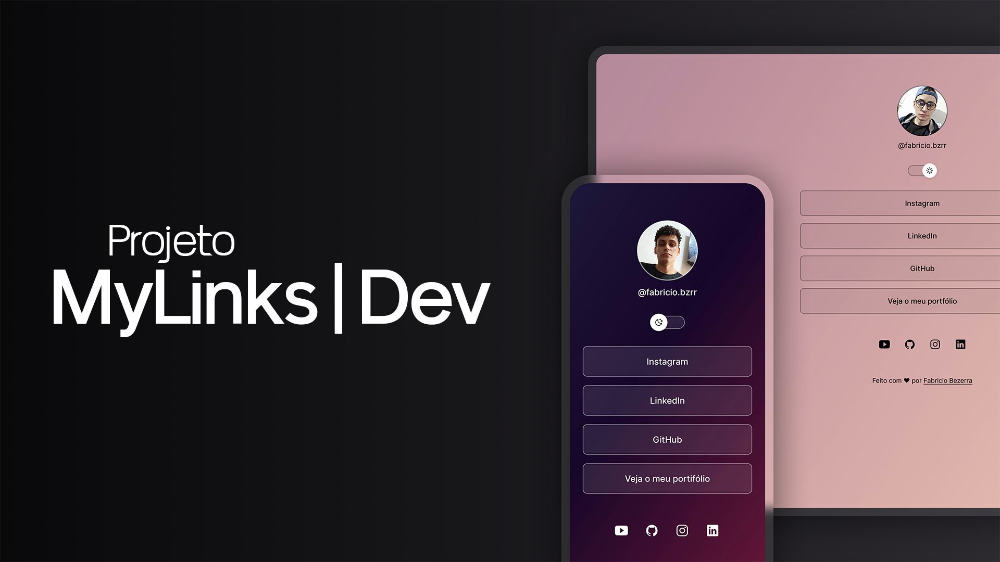

<h1 align="center"> MyLinks | Dev </h1>

Projeto desenvolvido por Fabricio Bezerra com o propósito de aplicar e consolidar os conhecimentos adquiridos ao longo de sua jornada de aprendizado.

  <a href="#-tecnologias">Tecnologias</a>&nbsp;&nbsp;&nbsp;|&nbsp;&nbsp;&nbsp;
  <a href="#-projeto">Projeto</a>&nbsp;&nbsp;&nbsp;|&nbsp;&nbsp;&nbsp;
  <a href="#-layout">Layout</a>&nbsp;&nbsp;&nbsp;|&nbsp;&nbsp;&nbsp;
  <a href="#memo-licença">Licença</a>

  

 

  

## 🚀 Tecnologias

Esse projeto foi desenvolvido com as seguintes tecnologias:

- HTML e CSS
- JavaScript
- Git e Github
- Figma

## 💻 Projeto

MyLinks | Dev é um projeto agregador de links desenvolvido para funcionar como um cartão de visitas online, reunindo em um só lugar portfólio, redes sociais, contatos e outros links relevantes. O objetivo é tornar a apresentação pessoal e profissional mais prática e acessível, permitindo que qualquer pessoa conheça rapidamente quem você é e o que faz de forma clara e organizada.

## 🔖 Layout

Você pode visualizar o layout do projeto através [DESSE LINK](https://www.figma.com/community/file/1187422022288947321). É necessário ter conta no [Figma](https://figma.com) para acessá-lo.

## :memo: Licença

Esse projeto está sob a licença MIT.

---

Desenvolvido por **Fabricio Bezerra**.  
Se desejar comentar o projeto ou propor colaborações, estou à disposição!

---

Obrigado por visitar — que este projeto inspire criatividade e evolução contínua.
